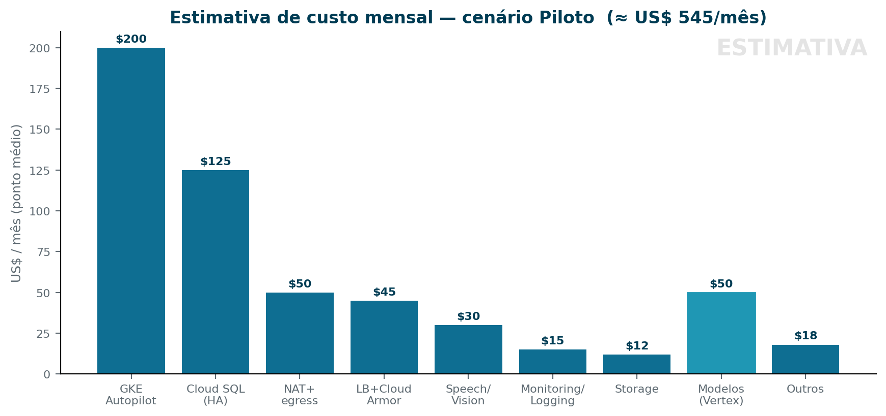

# Orçamento estimado — infraestrutura GCP (setup.com.br)

> ⚠️ **São estimativas.** Preços do Google Cloud aproximados (ordem de grandeza),
> baseline **us-central1**; **São Paulo (southamerica-east1) costuma custar
> ~15–30% a mais**. Custo de IA é **por uso (tokens)** e domina a variação.
> Valide os números finais no **Google Cloud Pricing Calculator** antes de
> aprovar. Valores em **US$/mês**.

---

## 1. Premissas

| | Piloto (enxuto) | Produção (HA completa) |
|---|---|---|
| Usuários ativos | dezenas | centenas |
| Réplicas (GKE) | mínimas (~3–4 vCPU, 6–8 GB) | redundantes (~8–12 vCPU, 16–24 GB) |
| Cloud SQL | pequeno, HA | maior, HA |
| RAG | pgvector no Cloud SQL (sem custo extra de índice) | Vertex Vector Search (índice dedicado) |
| Volume de IA | leve (Haiku/Sonnet, pouco Opus) | moderado/alto |

---

## 2. Itemização (US$/mês, aproximado)

| Serviço | Piloto | Produção | Observação |
|---|---|---|---|
| **GKE Autopilot** (pods + taxa de cluster) | 150–250 | 400–800 | paga por pod ativo |
| **Cloud SQL PostgreSQL (HA)** | 90–160 | 400–700 | HA ~dobra o preço da instância |
| **Vertex AI Vector Search / pgvector** | ~0 (pgvector) | 250–500 | índice dedicado tem mínimo |
| **Cloud Storage + backups** | 5–20 | 20–80 | mídia, docs, PITR |
| **Pub/Sub + Cloud Tasks** | 0–10 | 10–50 | franquia generosa |
| **Secret Manager** | 1–5 | 5–15 | por segredo/acesso |
| **Load Balancer + Cloud Armor** | 30–60 | 60–120 | WAF na borda |
| **Cloud NAT + egress** | 35–70 | 80–250 | varia com o tráfego |
| **Speech-to-Text / Vision / Document AI** | 10–50 | 50–300 | por uso (áudio/OCR) |
| **Cloud Monitoring / Logging** | 0–30 | 30–150 | acima da franquia |
| **Cloud Build + Artifact Registry** | 0–20 | 10–40 | CI/CD + imagens |
| **Subtotal infraestrutura** | **~330–700** | **~1.300–3.000** | sem os modelos |

> Gráfico do cenário Piloto (pontos médios) na figura abaixo.

---

## 3. Modelos de IA (Vertex AI / Claude) — por uso, calculado à parte

Preços de referência por **milhão de tokens** (entrada / saída, aprox.):
Haiku ~0,80 / 4 · Sonnet ~3 / 15 · Opus ~15 / 75.

**Exemplo (piloto leve)** — 5M tokens de entrada + 1M de saída/mês, mix
70% Haiku · 25% Sonnet · 5% Opus → **≈ US$ 20–40/mês**.

Escala aproximadamente linear com o volume:
| Uso | Tokens/mês (in/out) | Custo aprox. |
|---|---|---|
| Leve | 5M / 1M | US$ 20–40 |
| Moderado | 30M / 6M | US$ 150–300 |
| Intenso (muito Opus) | 100M / 20M | US$ 1.000+ |

**Redutor de custo nº 1:** roteamento Haiku→Sonnet→Opus (usar o modelo caro só
quando necessário) + cache de respostas/embeddings.

---

## 4. Total estimado

| Cenário | Infra | Modelos | **Total (US$/mês)** |
|---|---|---|---|
| **Piloto** | 330–700 | 20–100 | **≈ 400–800** |
| **Produção** | 1.300–3.000 | 200–1.500 | **≈ 1.500–4.500** |

**Em reais** (câmbio ilustrativo ~R$ 5,5/US$ — ajuste ao câmbio do dia, e some o
prêmio de ~20% se hospedar em São Paulo):
- Piloto ≈ **R$ 2.200–4.400/mês**
- Produção ≈ **R$ 8.000–25.000/mês**

---

## 5. Como reduzir o custo

- **Tier de modelo correto** (Haiku para o volume; Opus só no complexo) + **cache**.
- **Autoscaling / `min-instances` enxutos**; desligar o que é sob demanda
  (computer-use, doc-worker) fora de uso.
- **pgvector no Cloud SQL** em vez de Vector Search no piloto (evita o mínimo do índice).
- **Lifecycle no Cloud Storage** (mover backups antigos para classes frias).
- **Committed Use Discounts** (1–3 anos) e **região us-central1** se latência
  permitir (mais barata que São Paulo).
- **Medir antes de escalar** (mesma lógica do nosso framework de indicadores):
  dimensione com o volume real após a Fase 2 da migração.

---

## 6. Como obter o número exato

1. Abra o **Google Cloud Pricing Calculator** (cloud.google.com/products/calculator).
2. Lance os itens da seção 2 com a **sua escala real** (vCPU/GB, instância do SQL,
   GB de storage, requisições) e a **região** desejada.
3. Para os modelos, multiplique o **volume de tokens** esperado pelos preços do
   tier (seção 3).
4. Some 1 + 3. Reavalie mensalmente com o consumo medido.

*Estimativas para planejamento — não são cotação. Confirme no Pricing Calculator.*
