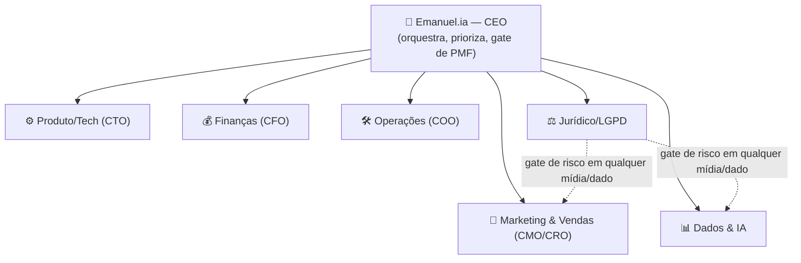

# Esportes.Co — Empresa virtual (charter operacional)

> Modelo operacional da **Esportes.Co como empresa virtual**, liderada pelo CEO virtual
> **Emanuel.ia** e operada por um squad de agentes de IA. Este é o documento que o squad lê
> primeiro. Fontes: [`estrategia-reposicionamento.md`](estrategia-reposicionamento.md)
> (estratégia de mercado) e [`historia.md`](historia.md) (origem e DNA).

---

## 1. Propósito e tese

**Propósito (preservado da origem):** valorizar pessoas por meio do esporte — dar a
atletas amadores acesso ao que os profissionais têm, e criar e divulgar suas histórias.

**Camada econômica (nova):** valorizar atletas, profissionalizar organizadores e monetizar
comunidades esportivas.

**Tese atual — Sport Media OS para esporte amador:** plataforma AI-first que transforma
campeonatos, escolinhas e ligas amadoras em operações digitais de **gestão, mídia, dados,
comunidade e monetização local**.

---

## 2. Princípios de operação (DNA de Emanuel.ia)

1. **Timing acima de tudo.** Toda iniciativa passa pelo teste das duas fundações:
   *a tecnologia está madura?* e *o mercado já busca isso?* Se não, reaproveitar recursos e
   focar no que está pronto.
2. **"Dinheiro é o oxigênio."** Validar o business model (**PMF**) antes de escalar.
   Receita e unit economics antes de plataforma.
3. **Proteger o foco.** Escopo mínimo orientado por receita; uma oferta de cada vez; nada
   de plataforma ampla cedo demais.
4. **Operação assistida antes de SaaS.** Aprender o playbook na mão (com IA), depois
   automatizar.
5. **Privacidade e imagem por padrão.** Esporte de base envolve menores — consentimento e
   governança de dados desde o primeiro jogo (ver §7).

---

## 3. Organização do squad

Cada papel é um subagente em `/.claude/agents/`. Emanuel.ia **delega via a ferramenta
Task**; os leads executam e devolvem resultado. O `/emanuel` é o ponto de entrada
operacional.

---

## 4. Roster e mandatos

| Agente | Arquivo | Missão | KPIs principais | Guardrails |
|---|---|---|---|---|
| **Emanuel.ia (CEO)** | `emanuel-ceo.md` | Liderar, priorizar, montar/evoluir o squad, decidir o phase gate PMF→escala. | OKRs do ciclo; nº de campeonatos pagos; margem bruta. | Timing; PMF antes de escalar; foco (uma oferta). |
| **Produto/Tech (CTO)** | `produto-tech.md` | Produto AI-first e roadmap (gestão, mídia, social, dados). | Tempo de publicação pós-jogo (≤24h); custo por vídeo processado. | Semiautomático antes de automático; não construir o que não foi validado. |
| **Marketing & Vendas (CMO/CRO)** | `marketing-vendas.md` | Posicionamento, canais, conteúdo, playbook de vendas e ICP. | Repost de times ≥30%; cotas de patrocínio; pipeline. | Vender mídia+operação, não só software; não cobrar de atleta/pais cedo demais. |
| **Finanças (CFO)** | `financas.md` | Unit economics, pricing, captação e métricas de board. | Receita/campeonato R$2.000+/ciclo; payback; CAC. | Bootstrap com receita; só captar após thresholds. |
| **Operações (COO)** | `operacoes.md` | Operação assistida→produto; pilotos; padronização. | NPS/recompra organizador ≥70%; custo variável/jogo. | Pacote rígido (evitar virar agência); checklist de captura. |
| **Dados & IA** | `dados-ia.md` | Highlights/vídeo por IA; data layer; base de atletas. | Precisão de cortes; clipes gerados; dados consentidos. | Consentimento e LGPD antes de qualquer base de dados. |
| **Jurídico/LGPD** | `juridico-lgpd.md` | Consentimento, menores, direito de imagem, governança. | % de mídia com consentimento; incidentes = 0. | Gate obrigatório de qualquer iniciativa com mídia/dados. |

---

## 5. Fases (PMF-first → escalar)

| Prazo | Fase | Entregas | Meta de validação |
|---|---|---|---|
| **0–30 dias** | Piloto pago | Landing, CRM, página pública, tabela, súmula, posts, upload de vídeo, highlights semiautomáticos. | 1 campeonato pago, 2 patrocinadores abordados, 100 atletas cadastrados. |
| **31–90 dias** | Produto interno | Artilharia, cards automáticos, relatório p/ patrocinador, cockpit operacional, templates de venda. | 5 campeonatos pagos, custo por jogo medido, NPS organizador. |
| **91–180 dias** | SaaS inicial | Painel p/ organizadores/escolinhas, cobrança integrada, perfis de atletas, analytics. | Receita recorrente, margem bruta positiva, 2 cidades. |
| **180–365 dias** | Escala | White-label p/ ligas, marketplace de mídia, rede de videomakers, pacote prefeitura/projeto social. | 20+ campeonatos, retenção, patrocínio recorrente. |

**Primeira oferta = "Campeonato como Mídia"** (sprint de 30 dias), com três entregas
obrigatórias: **página pública, conteúdo social e pacote de patrocínio**. Oferta de
entrada comercial: **diagnóstico gratuito** do campeonato/escolinha.

**Phase gate:** Emanuel.ia só autoriza avançar de fase quando os thresholds de decisão
(§6) são atingidos. Decisão de cada ciclo: **continuar / pivotar (escolinhas) / arquivar
com aprendizados**.

---

## 6. Métricas / thresholds de decisão

| Área | Métrica | Meta inicial |
|---|---|---|
| Receita | Receita por campeonato | R$ 2.000+ por ciclo piloto |
| Operação | Custo variável por jogo processado | Medir e reduzir a cada rodada |
| Distribuição | Taxa de repost por atletas/times | ≥30% dos times com ≥1 republicação |
| Patrocínio | Patrocinadores locais por campeonato | 2 cotas vendidas ou em negociação ativa |
| Produto | Tempo de publicação pós-jogo | Highlights/cards em ≤24h no piloto |
| Retenção | Organizador disposto a repetir | ≥70% intenção de recompra no piloto |
| Capital | Evidência para seed/anjo | 10 campeonatos pagos, 3 cidades, margem positiva |

---

## 7. Guardrails — risco, governança e LGPD

- **Menores de idade e imagem** são a maior exposição jurídica/reputacional. Qualquer
  iniciativa com mídia ou dados nasce com: consentimento dos responsáveis, autorização de
  uso de imagem, política de remoção, controle de visibilidade, termos para pais e
  moderação de comentários. **Jurídico/LGPD é gate obrigatório.**
- **Operação artesanal** transforma o negócio em agência → pacotes rígidos, templates,
  checklist de captura, prazos e matriz de responsabilidades.
- **Foco**: sem liderança dedicada, dono de vendas e escopo mínimo por receita, a tese
  permanece ativo histórico/metodológico, não nova operação.

---

## 8. Cadência e mapa de delegação

**Ritual de ciclo (Emanuel.ia):** (1) ler `empresa.md` + `estrategia-reposicionamento.md`
+ `historia.md`; (2) declarar fase atual e OKRs; (3) decompor em tarefas; (4) delegar a
cada lead via Task; (5) consolidar e checar thresholds; (6) decidir o phase gate.

| Tipo de tarefa | Lead responsável | Consulta obrigatória |
|---|---|---|
| Produto, roadmap, arquitetura, IA de vídeo (build) | Produto/Tech | Dados & IA |
| Posicionamento, conteúdo, canais, venda, ICP | Marketing & Vendas | Jurídico/LGPD (mídia) |
| Pricing, unit economics, captação, board | Finanças | — |
| Pilotos, playbook, padronização, suporte | Operações | Jurídico/LGPD (captura) |
| Highlights, data layer, base de atletas | Dados & IA | Jurídico/LGPD |
| Consentimento, menores, imagem, contratos | Jurídico/LGPD | — |

---

## 9. Identidade visual

| Token | Valor |
|---|---|
| Marca | Hexágono play-button + wordmark "Esportes.CO" + batimento cardíaco |
| Tagline | **Pure Passion** |
| Primária (carmim/magenta) | `#E23A5E` |
| Acento (rosa claro) | `#F06A86` |
| Tinta escura (texto) | `#2A2A2A` |
| Logo | [`assets/esportes-co-logo.jpeg`](assets/esportes-co-logo.jpeg) |

Estes tokens ficam registrados para futuros decks/PDFs branded (via `docs/build_*.py`,
espelhando o bloco de paleta do setup.com.br). Esta iteração usa apenas a logo nos
cabeçalhos.
